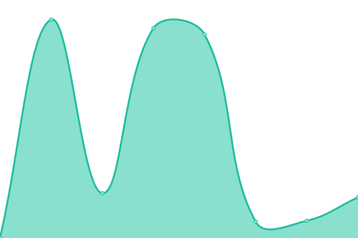

# [📈 Live Status](https://taylor-work.github.io/10x-uptime): <!--live status--> **🟧 Partial outage**

This repository contains the open-source uptime monitor and status page for [Taylor Zajicek](https://taylor-work.github.io/10x-uptime), powered by [Upptime](https://github.com/upptime/upptime).

With [Upptime](https://upptime.js.org), you can get your own unlimited and free uptime monitor and status page, powered entirely by a GitHub repository. We use [Issues](https://github.com/taylor-work/10x-uptime/issues) as incident reports, [Actions](https://github.com/taylor-work/10x-uptime/actions) as uptime monitors, and [Pages](https://taylor-work.github.io/10x-uptime) for the status page.

<!--start: status pages-->
<!-- This summary is generated by Upptime (https://github.com/upptime/upptime) -->
<!-- Do not edit this manually, your changes will be overwritten -->
<!-- prettier-ignore -->
| URL | Status | History | Response Time | Uptime |
| --- | ------ | ------- | ------------- | ------ |
|  [BEA.GOV](https://BEA.GOV) | 🟩 Up | [bea-gov.yml](https://github.com/taylor-work/10x-uptime/commits/HEAD/history/bea-gov.yml) | 

 389ms
     
 | 

<a href="https://taylor-work.github.io/10x-uptime/history/bea-gov">100.00%</a>
    

|  [BLDRDOC.GOV](https://BLDRDOC.GOV) | 🟥 Down | [bldrdoc-gov.yml](https://github.com/taylor-work/10x-uptime/commits/HEAD/history/bldrdoc-gov.yml) | 

 0ms
     
 | 

<a href="https://taylor-work.github.io/10x-uptime/history/bldrdoc-gov">0.00%</a>
    

|  [BUYUSA.GOV](https://BUYUSA.GOV) | 🟩 Up | [buyusa-gov.yml](https://github.com/taylor-work/10x-uptime/commits/HEAD/history/buyusa-gov.yml) | 

 370ms
     
 | 

<a href="https://taylor-work.github.io/10x-uptime/history/buyusa-gov">100.00%</a>
    

|  [CENSUS.GOV](https://CENSUS.GOV) | 🟩 Up | [census-gov.yml](https://github.com/taylor-work/10x-uptime/commits/HEAD/history/census-gov.yml) | 

 475ms
     
 | 

<a href="https://taylor-work.github.io/10x-uptime/history/census-gov">100.00%</a>
    

|  [CLIMATE.GOV](https://CLIMATE.GOV) | 🟩 Up | [climate-gov.yml](https://github.com/taylor-work/10x-uptime/commits/HEAD/history/climate-gov.yml) | 

 471ms
     
 | 

<a href="https://taylor-work.github.io/10x-uptime/history/climate-gov">100.00%</a>
    

|  [COMMERCE.GOV](https://COMMERCE.GOV) | 🟩 Up | [commerce-gov.yml](https://github.com/taylor-work/10x-uptime/commits/HEAD/history/commerce-gov.yml) | 

 834ms
     
 | 

<a href="https://taylor-work.github.io/10x-uptime/history/commerce-gov">100.00%</a>
    

|  [DNSOPS.GOV](https://DNSOPS.GOV) | 🟩 Up | [dnsops-gov.yml](https://github.com/taylor-work/10x-uptime/commits/HEAD/history/dnsops-gov.yml) | 

 647ms
     
 | 

<a href="https://taylor-work.github.io/10x-uptime/history/dnsops-gov">100.00%</a>
    

|  [DOC.GOV](https://DOC.GOV) | 🟩 Up | [doc-gov.yml](https://github.com/taylor-work/10x-uptime/commits/HEAD/history/doc-gov.yml) | 

 790ms
     
 | 

<a href="https://taylor-work.github.io/10x-uptime/history/doc-gov">100.00%</a>
    

|  [DROUGHT.GOV](https://DROUGHT.GOV) | 🟥 Down | [drought-gov.yml](https://github.com/taylor-work/10x-uptime/commits/HEAD/history/drought-gov.yml) | 

 512ms
     
 | 

<a href="https://taylor-work.github.io/10x-uptime/history/drought-gov">0.00%</a>
    

|  [EARTHSYSTEMPREDICTION.GOV](https://EARTHSYSTEMPREDICTION.GOV) | 🟥 Down | [earthsystemprediction-gov.yml](https://github.com/taylor-work/10x-uptime/commits/HEAD/history/earthsystemprediction-gov.yml) | 

 0ms
     
 | 

<a href="https://taylor-work.github.io/10x-uptime/history/earthsystemprediction-gov">100.00%</a>
    

|  [EDA.GOV](https://EDA.GOV) | 🟩 Up | [eda-gov.yml](https://github.com/taylor-work/10x-uptime/commits/HEAD/history/eda-gov.yml) | 

 140ms
     
 | 

<a href="https://taylor-work.github.io/10x-uptime/history/eda-gov">100.00%</a>
    

|  [EXPORT.GOV](https://EXPORT.GOV) | 🟩 Up | [export-gov.yml](https://github.com/taylor-work/10x-uptime/commits/HEAD/history/export-gov.yml) | 

 1008ms
     
 | 

<a href="https://taylor-work.github.io/10x-uptime/history/export-gov">100.00%</a>
    

|  [FIRSTNET.GOV](https://FIRSTNET.GOV) | 🟥 Down | [firstnet-gov.yml](https://github.com/taylor-work/10x-uptime/commits/HEAD/history/firstnet-gov.yml) | 

 342ms
     
 | 

<a href="https://taylor-work.github.io/10x-uptime/history/firstnet-gov">100.00%</a>
    

|  [FISHWATCH.GOV](https://FISHWATCH.GOV) | 🟩 Up | [fishwatch-gov.yml](https://github.com/taylor-work/10x-uptime/commits/HEAD/history/fishwatch-gov.yml) | 

 482ms
     
 | 

<a href="https://taylor-work.github.io/10x-uptime/history/fishwatch-gov">100.00%</a>
    

|  [GOES-R.GOV](https://GOES-R.GOV) | 🟩 Up | [goes-r-gov.yml](https://github.com/taylor-work/10x-uptime/commits/HEAD/history/goes-r-gov.yml) | 

 268ms
     
 | 

<a href="https://taylor-work.github.io/10x-uptime/history/goes-r-gov">100.00%</a>
    

<!--end: status pages-->

[**Visit our status website →**](https://taylor-work.github.io/10x-uptime)

## 📄 License

- Powered by: [Upptime](https://github.com/upptime/upptime)
- Code: [MIT](./LICENSE) © [Taylor Zajicek](https://taylor-work.github.io/10x-uptime)
- Data in the `./history` directory: [Open Database License](https://opendatacommons.org/licenses/odbl/1-0/)
